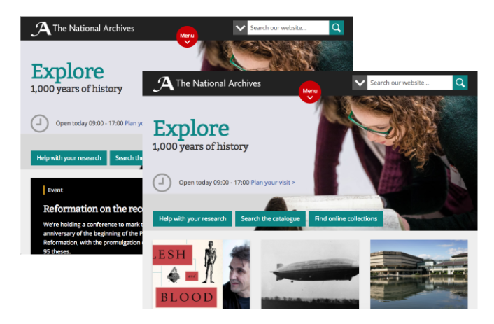

# A/B Testing Experiments

This repository provides a simple sandbox for exploring variant testing in Google Optimize and describes some options for how we might use it.

## Summary

* Google Optimize seems to be a good option that will allow us to:
    * Perform experiments with quite fine grained control over cohorts, duration and device characteristics
    * Conduct A/B testing ranging from small changes (involving minor stylistic changes or editorial changes) to larger structural, behaviour and multi-page experiences using the redirect variant.
    * Link these experiments with our goals in Google Analytics
* From a development perspective these experiments would need to be carefully managed to avoid remnants from previous experiments littering our code base. An update to our [Development Guide](https://github.com/nationalarchives/development-guide) is needed to support this
* This has been a technical dive into Google Optimize, we should look properly into the T&Cs etc and consider any necessary updates to The National Archives' [cookie policy](http://www.nationalarchives.gov.uk/legal/cookies.htm)

### Where testing variants options might be applied

|                                               | Optimize A/B       | Redirect           | Example                                                                         |
| --------------------------------------------- |:-------------:     | :--------:         |:------------------:                                                             |
| Static URLs                                   | :white_check_mark: | :white_check_mark: | `http://www.nationalarchives.gov.uk/about/visit-us/`                            |
| Static URLs with state passed in query string | :white_check_mark: | :white_check_mark: | `http://discovery.nationalarchives.gov.uk/results/r?_q=nelson&_col=200&_hb=tna` |
| Static URLs with state passed in hash         | :white_check_mark: | :white_check_mark: | `http://www.nationalarchives.gov.uk/webarchive/atoz/#t`                         |
| Dynamic URLs with state passed in path        | :white_check_mark: |                    | `http://a-b-testing-experiments.azurewebsites.net/details/C4462857 http://a-b-testing-experiments.azurewebsites.net/details/D8206854` |

-------

## What's being explored

We're exploring A/B testing using the types described in the [Website Testing 101 White Paper](https://cdn.webtrends.com/files/resources/Whitepaper-WebsiteTesting101-Webtrends-2015.pdf). These are:

* **A/B testing** - one design, group of elements or copy is compared to another, where a portion of live traffic is routed to each. Types of A/B test include:
    * **Template test** - different layouts and/or creative treatment 
    * **New concept test** - comparing two very distinct pages
    * **Funnel test** - comparing different multi-page experiences

## Practical examples using Google Optimize

### The A/B Test

In practical terms, what Google Optimize describe as a A/B test will be best suited to an A/B Template Test focused on creative treatment that can be achieved through: 

* CSS alone
* Minor text changes (within, for example, buttons but not ideally suited to changes within large blocks of text)

We have created an active Google Optimize experiment at [http://a-b-testing-experiments.azurewebsites.net/](http://a-b-testing-experiments.azurewebsites.net/) which shows 50% of visitors teal buttons and 50% of visitors black buttons with a teal border 


#### Information for developers

These changes were made in the Google Optimize dashboard by creating a variant and assigning the related CSS styles. It appears that each 'experiment' requires an amendment to the Google Analytics code snippet on the corresponding page. For example, the A/B test above needed an additional `require()`, a new `<style>` block and a new `(function(a,s,y,n,c,h,i.d.e) { ... })` call: 

```html
<style>.async-hide { opacity: 0 !important} </style>
<script>(function(a,s,y,n,c,h,i,d,e){s.className+=' '+y;h.start=1*new Date;
        h.end=i=function(){s.className=s.className.replace(RegExp(' ?'+y),'')};
        (a[n]=a[n]||[]).hide=h;setTimeout(function(){i();h.end=null},c);h.timeout=c;
    })(window,document.documentElement,'async-hide','dataLayer',4000,
        {'GTM-WK69MVV':true});</script>

<script>
    (function(i,s,o,g,r,a,m){i['GoogleAnalyticsObject']=r;i[r]=i[r]||function(){
        (i[r].q=i[r].q||[]).push(arguments)},i[r].l=1*new Date();a=s.createElement(o),
        m=s.getElementsByTagName(o)[0];a.async=1;a.src=g;m.parentNode.insertBefore(a,m)
    })(window,document,'script','https://www.google-analytics.com/analytics.js','ga');
    ga('create', 'UA-108354863-1', 'auto');
    ga('require', 'GTM-WK69MVV');
    ga('send', 'pageview');
</script>
```

Having looked at the behaviour of this code it seems Google achieve this by:

* applying the `.async-hide` class to prevent a flash of unstyled content as the page loads
* injecting inline `<style>` blocks with the rules added via the dashboard
* removing the `.async-hide` class to reveal the content, which now has the desired styles applied

Note: while this does not seem to significantly impact upon progressive enhancement since those users who are unable to run JavaScript will see the original variant, those users who do have JavaScript will have any content with `.async-hide` hidden from them until the relevant scripts have run. 

### Google Optimize Redirect Test

In practical terms within a CMS environment, the Redirect Test will allow us to significantly amend the structure, content CSS and JavaScript. It therefore seems most suited to: 
* the 'Template Test - Different Layout' and 'New Concept' variants of A/B Tests
* where the full URL is known

We have created an active Google Optimize redirect experiment at [http://a-b-testing-experiments.azurewebsites.net/redirect-test/](http://a-b-testing-experiments.azurewebsites.net/redirect-test/) which redirects 50% of users to a different page (within a `/new/` directory) that has a different layout.



#### Information for developers

This test required the creation of a new page, inclusion of the necessary experiment code (as above) and setting up the redirect in Google Optimize.

Having looked at code it appears to: 

* make use of the `.async-hide` technique (mentioned above)
* uses JavaScript to perform a client-side redirect
* appends a query string with the experiment ID **to all impressions, regardless of whether the user is redirected or not** as well as retain any existing query strings

## Local development with this repository

### Development environment

Simply clone this repository to your development machine and start a PHP development server with `php -S localhost:8000`.

### Cloud deployment

There is an Azure website at [http://a-b-testing-experiments.azurewebsites.net/](http://a-b-testing-experiments.azurewebsites.net/) tracking `master` on GitHub.